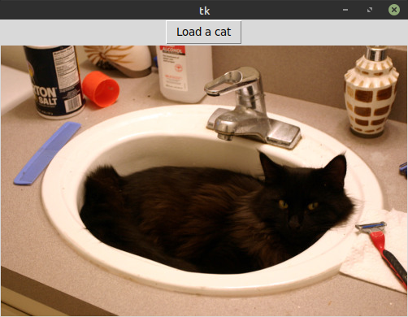

# Asynchronous Tkinter Mainloop

[](https://github.com/insolor/asynctk/actions/workflows/python-package.yml)

An implementation of asynchronous `main_loop` for tkinter, the use of which allows using `async` handler functions.

Based on ideas from:

* my answer on ru.stackoverflow.com: <https://ru.stackoverflow.com/a/1043146>
* answer of [Terry Jan Reedy](https://stackoverflow.com/users/722804) on stackoverflow.com: <https://stackoverflow.com/a/47896365>
* answer of [jfs](https://ru.stackoverflow.com/users/23044) on ru.stackoverflow.com: <https://ru.stackoverflow.com/a/804609>


## Some examples

Basic example:
```python
import asyncio
import tkinter as tk

from async_tkinter_loop import async_mainloop, async_command


async def counter():
    i = 0
    while True:
        i += 1
        label['text'] = str(i)
        await asyncio.sleep(1.0)


root = tk.Tk()

label = tk.Label(root)
label.pack()

tk.Button(root, text="Start", command=async_command(counter)).pack()

async_mainloop(root)
```

A more practical example, downloading an image from the Internet with [aiohttp](https://github.com/aio-libs/aiohttp) and displaying it in the Tkinter window:

```python
import tkinter as tk
from io import BytesIO

import aiohttp
from PIL import Image, ImageTk

from async_tkinter_loop import async_mainloop, async_command


async def load_image(url):
    button['state'] = 'disabled'
    label['text'] = 'Loading cat...'

    async with aiohttp.ClientSession() as session:
        response = await session.get(url)
        if response.status != 200:
            label['text'] = f'HTTP error {response.status}'
        else:
            content = await response.content.read()
            pil_image = Image.open(BytesIO(content))
            image = ImageTk.PhotoImage(pil_image)
            label.config(image=image, text='')
            label.image = image
            button['state'] = 'normal'


url = "http://thecatapi.com/api/images/get?format=src&type=jpg"


root = tk.Tk()

button = tk.Button(root, text='Load a cat', command=async_command(load_image, url))
button.pack()

label = tk.Label(root)
label.pack()

if __name__ == "__main__":
    async_mainloop(root)
```




More examples see in the [`examples`](https://github.com/insolor/async-tkinter-loop/tree/master/examples) directory.


## Similar projects

* [Starwort/asynctk](https://github.com/Starwort/asynctk) ([on PyPi](https://pypi.org/project/asynctk/))
* [gottadiveintopython/asynctkinter](https://github.com/gottadiveintopython/asynctkinter) ([on PyPi](https://pypi.org/project/asynctkinter/))
* [Lucretiel/tkinter-async](https://github.com/Lucretiel/tkinter-async)
* [fluentpython/asyncio-tkinter](https://github.com/fluentpython/asyncio-tkinter)
